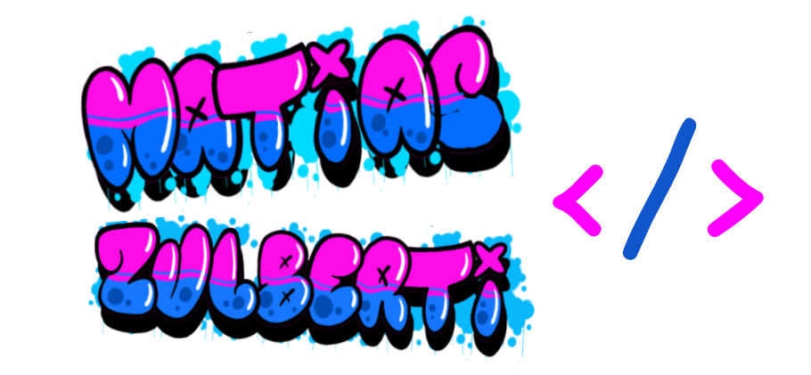
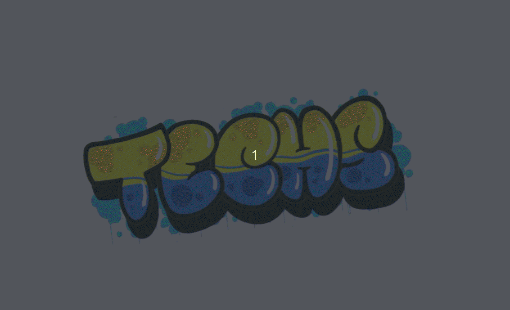

<!--- - 👋 Hi, I’m @Tolosa527
- 👀 I’m interested in ...
- 🌱 I’m currently learning ...
- 💞️ I’m looking to collaborate on ...
- 📫 How to reach me ...
--->

  

  &nbsp;&nbsp;&nbsp;&nbsp;&nbsp;
  &nbsp;&nbsp;&nbsp;&nbsp;
  

  

 
 
 

<!--- ABOUT ME SECTION --->
<!---
<h3>About me</h3>
<ul>
  <li>
I am currently working as a Python developer. &#129311; 🐍
</li>
  <li>
I am interested in microservices, web applications, APIs, and cloud infrastructures.
</li>
  <li>
I am looking for collaborate on open source projects.
</li>
</ul>
 

--->

<!--- STATS --->
<!---

  
  &nbsp;

 
 
--->

<!--- EXPERIENCE --->

  
  

 
 
